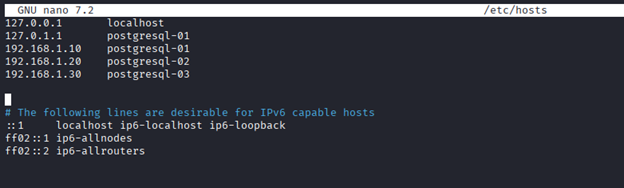
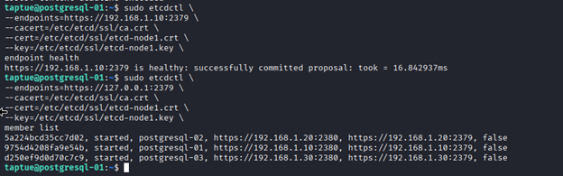
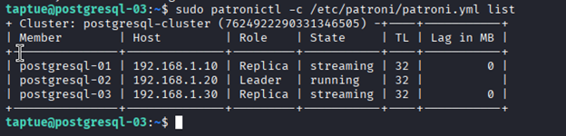
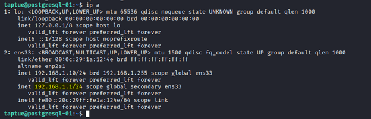
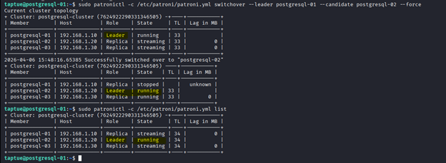
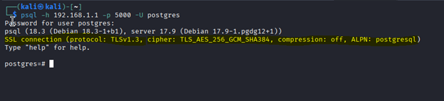
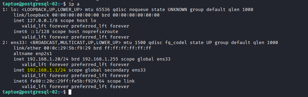

# 🚀 PostgreSQL High Availability Cluster

      

### Enterprise-Grade PostgreSQL High Availability Solution

**Patroni + etcd + HAProxy + Keepalived**

A **production-ready PostgreSQL High Availability (HA) cluster** built with battle-tested open-source tools on Debian 12.

This repository provides a complete, implementable solution for designing **fault-tolerant PostgreSQL infrastructure** with automatic failover, intelligent load balancing, and a floating Virtual IP (VIP) for seamless, uninterrupted database access.

### Ideal For

✨ **SaaS Platforms** - Eliminate downtime and provide HA for multi-tenant systems  
✨ **E-commerce Systems** - Keep your business running 24/7 with transparent failover  
✨ **Financial Systems** - Ensure zero data loss and compliance requirements  
✨ **Real-time Analytics** - Scale read operations with replicas, maintain write consistency  
✨ **Mission-Critical Services** - Deploy on-premises with full control  
✨ **Cost-Conscious Teams** - Open-source alternative to expensive managed databases  

---

## Table of Contents

- [Overview](#overview)
- [Quick Start](#quick-start)
- [Architecture](#architecture-overview)
- [Technologies & Network](#technologies-used)
- [Cluster Setup](#cluster-setup)
- [Failover Testing](#failover-testing)
- [Troubleshooting](#troubleshooting)
- [Future Improvements](#future-improvements)
- [Support & Contributing](#support--contributing)

---

## Overview

This solution delivers enterprise-grade database availability with **automatic failover**, **distributed consensus**, and **zero-downtime database switching**. Ideal for organizations requiring high availability, disaster recovery, and reliable database services.

### What You Get

| Capability | Benefit |
|-----------|----------|
| **99.9%+ Uptime** | Automatic failover recovers from failures in < 30 seconds |
| **Zero Data Loss** | Synchronous replication ensures RPO (Recovery Point Objective) = 0 |
| **Transparent to Apps** | Virtual IP handles failover; no connection string changes required |
| **Read Scaling** | Distribute read queries across replicas with HAProxy |
| **Offline Operations** | Perform maintenance on replicas without service interruption |
| **Enterprise Security** | SSL/TLS encryption for all cluster communication |
| **Production Ready** | Battle-tested components with proven reliability |

---

## Quick Start

For experienced operators, here's the fastest path to a working cluster:

1. **Prepare 3 Debian 12 servers** with network connectivity (< 5ms latency)
2. **On each node**, run the installation steps in order (Steps 1-9 below)
3. **Replace credentials and IPs** with your environment values
4. **Verify health** with `sudo patronictl -c /etc/patroni/patroni.yml list`
5. **Connect via VIP**: `psql -h 192.168.1.1 -p 5000 -U postgres`

For detailed instructions, see [Cluster Setup](#cluster-setup) below.

---

## Architecture Overview

### Why High Availability Matters

Modern applications demand **99.9%+ uptime** for their databases. This architecture eliminates single points of failure:
- **Automatic Failover**: Service traffic redirects to healthy nodes within seconds
- **Data Redundancy**: Streaming replication ensures zero data loss during failover
- **Load Distribution**: Read queries distribute across replicas; writes go to the primary
- **Static VIP**: Applications connect to one address; failover is transparent

### Design Overview

The cluster consists of **three PostgreSQL nodes** managed by Patroni and coordinated by etcd:

- **One Primary (Leader)** accepting read and write operations
- **Two Replicas (Standby)** providing read capacity and failover targets
- **Patroni**: Automates PostgreSQL cluster management and failover
- **etcd**: Provides distributed consensus and state coordination
- **HAProxy**: Intelligently routes traffic based on node role and health
- **Keepalived**: Manages a virtual IP (VIP) for transparent failover

Each component plays a critical role in ensuring reliability and performance:
- **Database Cluster**: PostgreSQL with streaming replication
- **Distributed Store**: etcd maintains cluster state and leader election
- **Load Balancer**: HAProxy separates read and write traffic
- **Failover Automation**: Patroni handles elections, recovery, and promotion

---

## Architecture Diagram


---

## Technologies Used

### Component Stack

| Component | Role |
|-----------|------|
| PostgreSQL 17 | Database engine |
| Patroni | PostgreSQL cluster manager |
| etcd | Distributed consensus store |
| HAProxy | Load balancer |
| Keepalived | Virtual IP failover |
| Debian 12 | Operating system |

**Architecture Workflow:**

1. **Patroni** continuously monitors PostgreSQL and coordinates with other nodes via etcd
2. **etcd** maintains cluster state, leader leases, and configuration
3. **HAProxy** health-checks each node's Patroni REST API
4. **Keepalived** maintains the VIP, monitoring HAProxy availability
5. **On Failover**: Patroni promotes a replica, HAProxy updates routing, VIP follows the new primary

This multi-layered approach ensures no single component failure impacts availability.

---

## Cluster Overview

### Cluster Nodes

| Hostname | IP Address | Role | Purpose |
|----------|------------|------|---------|
| postgresql-01 | 192.168.1.10 | Primary | Database leader, accepts all writes |
| postgresql-02 | 192.168.1.20 | Replica | Hot standby, read capacity, failover target |
| postgresql-03 | 192.168.1.30 | Replica | Hot standby, read capacity, failover target |
| **VIP** | **192.168.1.1** | **Floating** | **Application entry point (transparent failover)** |

### Ports and Services

| Port | Service | Protocol | Description | Notes |
|------|---------|----------|-----------|--------|
| 5432 | PostgreSQL | TCP | Direct DB connections | Not recommended for external use |
| 8008 | Patroni REST API | HTTPS | Cluster health checks | Used by HAProxy for routing |
| 2379 | etcd Client | HTTPS | etcd API communication | Inter-node coordination |
| 2380 | etcd Peer | HTTPS | etcd cluster replication | Peer-to-peer protocol |
| 5000 | HAProxy | TCP | Primary (read/write) | Applications connect here |
| 5001 | HAProxy | TCP | Replicas (read-only) | For read-only queries |
| 7000 | HAProxy Stats | HTTP | Web monitoring dashboard | Credentials required |

## Key Features

✔ **Automatic Failover** — Sub-second detection and recovery  
✔ **Leader Election** — Distributed consensus via etcd  
✔ **Streaming Replication** — Synchronous and asynchronous modes  
✔ **Intelligent Routing** — Separate read and write endpoints  
✔ **Replica Load Balancing** — Distribute read-heavy workloads  
✔ **Virtual IP Failover** — Transparent to applications  
✔ **SSL/TLS Encryption** — Secure intra-cluster communication  
✔ **Health Monitoring** — Real-time cluster state visibility  
✔ **Zero Data Loss** — Configured for RPO=0 (recovery point objective)  
✔ **Production Ready** — Tested configuration with best practices  

---

## Cluster Setup

Complete end-to-end deployment steps to build your PostgreSQL HA cluster.

### Step 1: Configure Hosts

On each server:

```sh
sudo nano /etc/hosts
```

Add:

```txt
192.168.1.10 primary
192.168.1.20 secondary
192.168.1.30 third
```


---

### Step 2: Install Dependencies

```sh
sudo apt update && sudo apt upgrade -y

sudo apt install -y \
  python3 \
  python3-pip \
  python3-psycopg2 \
  python3-yaml \
  python3-requests \
  curl \
  wget \
  gnupg \
  ca-certificates \
  lsb-release
```

---

### Step 3: Install and Configure etcd

On each server:

```sh
ETCD_VERSION="3.5.17"

wget "https://github.com/etcd-io/etcd/releases/download/v${ETCD_VERSION}/etcd-v${ETCD_VERSION}-linux-amd64.tar.gz" \
  -O /tmp/etcd.tar.gz

tar xzf /tmp/etcd.tar.gz -C /tmp

sudo cp /tmp/etcd-v${ETCD_VERSION}-linux-amd64/etcd* /usr/local/bin/
sudo chmod +x /usr/local/bin/etcd*
```

Verify installation:

```sh
etcd --version
```

Create the etcd system user and directories:

```sh
sudo useradd --system --shell /sbin/nologin --home /var/lib/etcd etcd
sudo mkdir -p /var/lib/etcd
sudo chown etcd:etcd /var/lib/etcd
sudo chmod 700 /var/lib/etcd

sudo mkdir -p /etc/etcd
sudo chown etcd:etcd /etc/etcd
```

Certificates for ectd 

```sh
mkdir certs
cd certs
```
Generate cert authority

```bash
openssl genrsa -out ca.key 2048
openssl req -x509 -new -nodes -key ca.key -subj "/CN=etcd-ca" -days 7300 -out ca.crt
```

Generate certificate each node. Note, pay attention to SANS, I am using IP, update with your IP and oh DNS/hostname.
 
### postgresql-01

```bash
openssl genrsa -out etcd-node1.key 2048

cat > temp.cnf <<EOF
[ req ]
distinguished_name = req_distinguished_name
req_extensions = v3_req
[ req_distinguished_name ]
[ v3_req ]
subjectAltName = @alt_names
[ alt_names ]
IP.1 = 192.168.1.10
IP.2 = 127.0.0.1
EOF

openssl req -new -key etcd-node1.key -out etcd-node1.csr \
  -subj "/C=CM/ST=Cameroon/L=Bamenda/O=CCMC/OU=Cybersecurity/CN=postgresql-01" \
  -config temp.cnf

openssl x509 -req -in etcd-node1.csr -CA ca.crt -CAkey ca.key -CAcreateserial \
  -out etcd-node1.crt -days 7300 -sha256 -extensions v3_req -extfile temp.cnf

openssl x509 -in etcd-node1.crt -text -noout | grep -A1 "Subject Alternative Name"

rm temp.cnf
```

### postgresql-02
```bash
openssl genrsa -out etcd-node2.key 2048

cat > temp.cnf <<EOF
[ req ]
distinguished_name = req_distinguished_name
req_extensions = v3_req
[ req_distinguished_name ]
[ v3_req ]
subjectAltName = @alt_names
[ alt_names ]
IP.1 = 192.168.1.20
IP.2 = 127.0.0.1
EOF

openssl req -new -key etcd-node2.key -out etcd-node2.csr \
-subj "/C=CM/ST=Cameroon/L=Bamenda/O=CCMC/OU=Cybersecurity/CN=postgresql-02" \
  -config temp.cnf

openssl x509 -req -in etcd-node2.csr -CA ca.crt -CAkey ca.key -CAcreateserial \
  -out etcd-node2.crt -days 7300 -sha256 -extensions v3_req -extfile temp.cnf

openssl x509 -in etcd-node2.crt -text -noout | grep -A1 "Subject Alternative Name"

rm temp.cnf
```

### postgresql-03
```bash
openssl genrsa -out etcd-node3.key 2048

cat > temp.cnf <<EOF
[ req ]
distinguished_name = req_distinguished_name
req_extensions = v3_req
[ req_distinguished_name ]
[ v3_req ]
subjectAltName = @alt_names
[ alt_names ]
IP.1 = 192.168.1.30
IP.2 = 127.0.0.1
EOF

openssl req -new -key etcd-node3.key -out etcd-node3.csr \
-subj "/C=CM/ST=Cameroon/L=Bamenda/O=CCMC/OU=Cybersecurity/CN=postgresql-03"\
  -config temp.cnf

openssl x509 -req -in etcd-node3.csr -CA ca.crt -CAkey ca.key -CAcreateserial \
  -out etcd-node3.crt -days 7300 -sha256 -extensions v3_req -extfile temp.cnf

openssl x509 -in etcd-node3.crt -text -noout | grep -A1 "Subject Alternative Name"

rm temp.cnf
```

Secure copy (scp) the certs to each node:
```bash
scp ca.crt etcd-node1.crt etcd-node1.key taptue@192.168.1.10:/tmp/
scp ca.crt etcd-node2.crt etcd-node2.key taptue@192.168.1.20:/tmp/
scp ca.crt etcd-node3.crt etcd-node3.key taptue@192.168.1.30:/tmp/
```

We need to move certs from /tmp to ssl location (/etc/etcd/ssl) :

```bash
sudo mkdir -p /etc/etcd/ssl
sudo mv /tmp/etcd-node*.crt /etc/etcd/ssl/
sudo mv /tmp/etcd-node*.key /etc/etcd/ssl/
sudo mv /tmp/ca.crt /etc/etcd/ssl/
sudo chown -R etcd:etcd /etc/etcd/
sudo chmod 600 /etc/etcd/ssl/etcd-node*.key
sudo chmod 644 /etc/etcd/ssl/etcd-node*.crt /etc/etcd/ssl/ca.crt
```

Create the file `/etc/etcd/etcd.conf` on each server.

```bash
sudo nano /etc/etcd/etcd.conf
```

### postgrsql-01

```env
ETCD_NAME="postgresql-01"
ETCD_DATA_DIR="/var/lib/etcd"
ETCD_INITIAL_CLUSTER="postgresql-01=https://192.168.1.10:2380,postgresql-02=https://192.168.1.20:2380,postgresql-03=https://192.168.1.30:2380"
ETCD_INITIAL_CLUSTER_STATE="new"
ETCD_INITIAL_CLUSTER_TOKEN="etcd-cluster"
ETCD_INITIAL_ADVERTISE_PEER_URLS="https://192.168.1.10:2380"
ETCD_LISTEN_PEER_URLS="https://0.0.0.0:2380"
ETCD_LISTEN_CLIENT_URLS="https://0.0.0.0:2379"
ETCD_ADVERTISE_CLIENT_URLS="https://192.168.1.10:2379"
ETCD_CLIENT_CERT_AUTH="true"
ETCD_TRUSTED_CA_FILE="/etc/etcd/ssl/ca.crt"
ETCD_CERT_FILE="/etc/etcd/ssl/etcd-node1.crt"
ETCD_KEY_FILE="/etc/etcd/ssl/etcd-node1.key"
ETCD_PEER_CLIENT_CERT_AUTH="true"
ETCD_PEER_TRUSTED_CA_FILE="/etc/etcd/ssl/ca.crt"
ETCD_PEER_CERT_FILE="/etc/etcd/ssl/etcd-node1.crt"
ETCD_PEER_KEY_FILE="/etc/etcd/ssl/etcd-node1.key"
```

### postgresql-02

```env
ETCD_NAME="postgresql-02"
ETCD_DATA_DIR="/var/lib/etcd"
ETCD_INITIAL_CLUSTER="postgresql-01=https://192.168.1.10:2380,postgresql-02=https://192.168.1.20:2380,postgresql-03=https://192.168.1.30:2380"
ETCD_INITIAL_CLUSTER_STATE="new"
ETCD_INITIAL_CLUSTER_TOKEN="etcd-cluster"
ETCD_INITIAL_ADVERTISE_PEER_URLS="https://192.168.1.20:2380"
ETCD_LISTEN_PEER_URLS="https://0.0.0.0:2380"
ETCD_LISTEN_CLIENT_URLS="https://0.0.0.0:2379"
ETCD_ADVERTISE_CLIENT_URLS="https://192.168.1.20:2379"
ETCD_CLIENT_CERT_AUTH="true"
ETCD_TRUSTED_CA_FILE="/etc/etcd/ssl/ca.crt"
ETCD_CERT_FILE="/etc/etcd/ssl/etcd-node2.crt"
ETCD_KEY_FILE="/etc/etcd/ssl/etcd-node2.key"
ETCD_PEER_CLIENT_CERT_AUTH="true"
ETCD_PEER_TRUSTED_CA_FILE="/etc/etcd/ssl/ca.crt"
ETCD_PEER_CERT_FILE="/etc/etcd/ssl/etcd-node2.crt"
ETCD_PEER_KEY_FILE="/etc/etcd/ssl/etcd-node2.key"
```

### postgresql-03

```env
ETCD_NAME="postgresql-03"
ETCD_DATA_DIR="/var/lib/etcd"
ETCD_INITIAL_CLUSTER="postgresql-01=https://192.168.1.10:2380,postgresql-02=https://192.168.1.20:2380,postgresql-03=https://192.168.1.30:2380"
ETCD_INITIAL_CLUSTER_STATE="new"
ETCD_INITIAL_CLUSTER_TOKEN="etcd-cluster"
ETCD_INITIAL_ADVERTISE_PEER_URLS="https://192.168.1.30:2380"
ETCD_LISTEN_PEER_URLS="https://0.0.0.0:2380"
ETCD_LISTEN_CLIENT_URLS="https://0.0.0.0:2379"
ETCD_ADVERTISE_CLIENT_URLS="https://192.168.1.30:2379"
ETCD_CLIENT_CERT_AUTH="true"
ETCD_TRUSTED_CA_FILE="/etc/etcd/ssl/ca.crt"
ETCD_CERT_FILE="/etc/etcd/ssl/etcd-node3.crt"
ETCD_KEY_FILE="/etc/etcd/ssl/etcd-node3.key"
ETCD_PEER_CLIENT_CERT_AUTH="true"
ETCD_PEER_TRUSTED_CA_FILE="/etc/etcd/ssl/ca.crt"
ETCD_PEER_CERT_FILE="/etc/etcd/ssl/etcd-node3.crt"
ETCD_PEER_KEY_FILE="/etc/etcd/ssl/etcd-node3.key"
```

Create a systemd service for etcd:

```sh
sudo tee /etc/systemd/system/etcd.service > /dev/null <<'EOF'
[Unit]
Description=etcd key-value store
Documentation=https://github.com/etcd-io/etcd
After=network-online.target
Wants=network-online.target

[Service]
Type=notify
WorkingDirectory=/var/lib/etcd
EnvironmentFile=/etc/etcd/etcd.conf
ExecStart=/usr/local/bin/etcd
Restart=always
RestartSec=10s
LimitNOFILE=40000
User=etcd
Group=etcd

[Install]
WantedBy=multi-user.target
EOF
```

Start the etcd cluster (run on all nodes around the same time):

```sh
sudo mkdir -p /var/lib/etcd 
sudo chown -R etcd:etcd /var/lib/etcd
sudo systemctl daemon-reload
sudo systemctl enable etcd
sudo systemctl start etcd
sudo systemctl status etcd
```

Check cluster health:

```sh
sudo etcdctl \
--endpoints=https://127.0.0.1:2379 \
--cacert=/etc/etcd/ssl/ca.crt \
--cert=/etc/etcd/ssl/etcd-node1.crt \
--key=/etc/etcd/ssl/etcd-node1.key \
endpoint health

sudo etcdctl \
--endpoints=https://127.0.0.1:2379 \
--cacert=/etc/etcd/ssl/ca.crt \
--cert=/etc/etcd/ssl/etcd-node1.crt \
--key=/etc/etcd/ssl/etcd-node1.key \
member list
```



---

### Step 4: Install PostgreSQL

Add the PostgreSQL repository:

```sh
DISTRO_RELEASE=$(lsb_release -cs)

curl -fsSL https://www.postgresql.org/media/keys/ACCC4CF8.asc \
  | sudo gpg --dearmor -o /usr/share/keyrings/postgresql-keyring.gpg

echo "deb [signed-by=/usr/share/keyrings/postgresql-keyring.gpg] http://apt.postgresql.org/pub/repos/apt ${DISTRO_RELEASE}-pgdg main" \
  | sudo tee /etc/apt/sources.list.d/pgdg.list

sudo apt update
```

Install PostgreSQL:

```sh
sudo apt install -y postgresql-17 postgresql-client-17 postgresql-contrib-17
```

Disable the default PostgreSQL service (Patroni will manage PostgreSQL):

```sh
sudo systemctl stop postgresql
sudo systemctl disable postgresql
```

#### PostgreSQL SSL Certificates

Create directories for PostgreSQL certificates:

```bash
sudo mkdir -p /var/lib/postgresql/data
sudo mkdir -p /var/lib/postgresql/ssl
```

Generate self-signed certificate:

```bash
openssl genrsa -out patroni-ca.key 2048
openssl req -x509 -new -nodes -key patroni-ca.key -sha256 -days 3650 -out patroni-ca.crt

openssl genrsa -out server.key 2048
openssl req -new -key server.key -out server.csr
```

Create certificate configuration file (required for SAN - Subject Alternative Names):

```bash
cat > san.cnf <<'EOF'
[req]
distinguished_name=req

[ v3_req ]
subjectAltName = @alt_names

[alt_names]
IP.1 = 192.168.1.10
IP.2 = 192.168.1.20
IP.3 = 192.168.1.30
EOF
```

Generate the signed certificate:

```bash
openssl x509 -req -in server.csr \
  -CA patroni-ca.crt \
  -CAkey patroni-ca.key \
  -CAcreateserial \
  -out server.crt \
  -days 3650 \
  -sha256 \
  -extfile san.cnf -extensions v3_req
```

Copy certificates to ALL nodes:

```bash
# Copy these files to each node:
# /var/lib/postgresql/ssl/server.crt
# /var/lib/postgresql/ssl/server.key
# /var/lib/postgresql/ssl/patroni-ca.crt
```

Set proper permissions on certificates:

```bash
sudo chmod 600 /var/lib/postgresql/ssl/server.key
sudo chmod 644 /var/lib/postgresql/ssl/server.crt
sudo chmod 600 /var/lib/postgresql/ssl/server.req
sudo chown postgres:postgres /var/lib/postgresql/data
sudo chown postgres:postgres /var/lib/postgresql/ssl/server.*
```

Configure access control for PostgreSQL to read etcd certificates:

```bash
sudo apt update
sudo apt install -y acl
```

**PostgreSQL-01:**

```bash
sudo setfacl -m u:postgres:r /etc/etcd/ssl/ca.crt
sudo setfacl -m u:postgres:r /var/lib/postgresql/ssl/patroni-ca.crt
sudo setfacl -m u:postgres:r /etc/etcd/ssl/etcd-node1.crt
sudo setfacl -m u:postgres:r /etc/etcd/ssl/etcd-node1.key
```

**PostgreSQL-02:**

```bash
sudo setfacl -m u:postgres:r /etc/etcd/ssl/ca.crt
sudo setfacl -m u:postgres:r /var/lib/postgresql/ssl/patroni-ca.crt
sudo setfacl -m u:postgres:r /etc/etcd/ssl/etcd-node2.crt
sudo setfacl -m u:postgres:r /etc/etcd/ssl/etcd-node2.key
```

**PostgreSQL-03:**

```bash
sudo setfacl -m u:postgres:r /etc/etcd/ssl/ca.crt
sudo setfacl -m u:postgres:r /var/lib/postgresql/ssl/patroni-ca.crt
sudo setfacl -m u:postgres:r /etc/etcd/ssl/etcd-node3.crt
sudo setfacl -m u:postgres:r /etc/etcd/ssl/etcd-node3.key
```

---

### Step 5: Install Patroni

On each server:

```sh
sudo pip3 install --break-system-packages "patroni[etcd]==4.0.4"
```

Verify the version:

```sh
patroni --version
```

---

### Step 6: Configure Patroni

Patroni manages:
- Cluster bootstrap
- Streaming replication
- Automatic failover
- PostgreSQL configuration

On each server, create the Patroni directory:

```bash
sudo mkdir -p /etc/patroni
sudo chown postgres:postgres /etc/patroni
sudo chmod 750 /etc/patroni
```

Create `/etc/patroni/patroni.yml` on each node with the following configurations :

> The configuration blocks below are examples; adjust IP addresses and node names as needed.

### postgresql-01 (primary)

```yaml
scope: postgresql-cluster
namespace: /service/
name: postgresql-01

etcd3:
  hosts: 192.168.1.10:2379,192.168.1.20:2379,192.168.1.30:2379
  protocol: https
  cacert: /etc/etcd/ssl/ca.crt
  cert: /etc/etcd/ssl/etcd-node1.crt
  key: /etc/etcd/ssl/etcd-node1.key

restapi:
  listen: 0.0.0.0:8008
  connect_address: 192.168.1.10:8008
  certfile: /var/lib/postgresql/ssl/server.crt
  keyfile: /var/lib/postgresql/ssl/server.key
  cafile: /var/lib/postgresql/ssl/patroni-ca.crt

bootstrap:
  dcs:
    ttl: 30
    loop_wait: 10
    retry_timeout: 10
    maximum_lag_on_failover: 1048576
    postgresql:
        parameters:
            ssl: 'on'
            ssl_cert_file: /var/lib/postgresql/ssl/server.crt
            ssl_key_file: /var/lib/postgresql/ssl/server.key
        pg_hba:
        - hostssl replication replicator 127.0.0.1/32 md5
        - hostssl replication replicator 192.168.1.10/32 md5
        - hostssl replication replicator 192.168.1.20/32 md5
        - hostssl replication replicator 192.168.1.30/32 md5
        - hostssl all all 127.0.0.1/32 md5
        - hostssl all all 0.0.0.0/0 md5
  initdb:
    - encoding: UTF8
    - data-checksums

postgresql:
  listen: 0.0.0.0:5432
  connect_address: 192.168.1.10:5432
  data_dir: /var/lib/postgresql/data
  bin_dir: /usr/lib/postgresql/17/bin
  authentication:
    superuser:
      username: postgres
      password: "admin123"
    replication:
      username: replicator
      password: "admin123"
  parameters:
    max_connections: 100
    shared_buffers: 256MB

tags:
  nofailover: false
  noloadbalance: false
  clonefrom: false
```

### postgresql-02 (secondary)

```yaml
scope: postgresql-cluster
namespace: /service/
name: postgresql-02

etcd3:
  hosts: 192.168.1.10:2379,192.168.1.20:2379,192.168.1.30:2379
  protocol: https
  cacert: /etc/etcd/ssl/ca.crt
  cert: /etc/etcd/ssl/etcd-node2.crt
  key: /etc/etcd/ssl/etcd-node2.key

restapi:
  listen: 0.0.0.0:8008
  connect_address: 192.168.1.20:8008
  certfile: /var/lib/postgresql/ssl/server.crt
  keyfile: /var/lib/postgresql/ssl/server.key
  cafile: /var/lib/postgresql/ssl/patroni-ca.crt

bootstrap:
  dcs:
    ttl: 30
    loop_wait: 10
    retry_timeout: 10
    maximum_lag_on_failover: 1048576
    postgresql:
        parameters:
            ssl: 'on'
            ssl_cert_file: /var/lib/postgresql/ssl/server.crt
            ssl_key_file: /var/lib/postgresql/ssl/server.key
        pg_hba:
        - hostssl replication replicator 127.0.0.1/32 md5
        - hostssl replication replicator 192.168.1.10/32 md5
        - hostssl replication replicator 192.168.1.20/32 md5
        - hostssl replication replicator 192.168.1.30/32 md5
        - hostssl all all 127.0.0.1/32 md5
        - hostssl all all 0.0.0.0/0 md5
  initdb:
    - encoding: UTF8
    - data-checksums

postgresql:
  listen: 0.0.0.0:5432
  connect_address: 192.168.1.20:5432
  data_dir: /var/lib/postgresql/data
  bin_dir: /usr/lib/postgresql/17/bin
  authentication:
    superuser:
      username: postgres
      password: "admin123"
    replication:
      username: replicator
      password: "admin123"
  parameters:
    max_connections: 100
    shared_buffers: 256MB

tags:
  nofailover: false
  noloadbalance: false
  clonefrom: false
```

### postgresql-03 (third)


```yaml
scope: postgresql-cluster
namespace: /service/
name: postgresql-03

etcd3:
  hosts: 192.168.1.10:2379,192.168.1.20:2379,192.168.1.30:2379
  protocol: https
  cacert: /etc/etcd/ssl/ca.crt
  cert: /etc/etcd/ssl/etcd-node3.crt
  key: /etc/etcd/ssl/etcd-node3.key

restapi:
  listen: 0.0.0.0:8008
  connect_address: 192.168.1.30:8008
  certfile: /var/lib/postgresql/ssl/server.crt
  keyfile: /var/lib/postgresql/ssl/server.key
  cafile: /var/lib/postgresql/ssl/patroni-ca.crt

bootstrap:
  dcs:
    ttl: 30
    loop_wait: 10
    retry_timeout: 10
    maximum_lag_on_failover: 1048576
    postgresql:
        parameters:
            ssl: 'on'
            ssl_cert_file: /var/lib/postgresql/ssl/server.crt
            ssl_key_file: /var/lib/postgresql/ssl/server.key
        pg_hba:
        - hostssl replication replicator 127.0.0.1/32 md5
        - hostssl replication replicator 192.168.1.10/32 md5
        - hostssl replication replicator 192.168.1.20/32 md5
        - hostssl replication replicator 192.168.1.30/32 md5
        - hostssl all all 127.0.0.1/32 md5
        - hostssl all all 0.0.0.0/0 md5
  initdb:
    - encoding: UTF8
    - data-checksums

postgresql:
  listen: 0.0.0.0:5432
  connect_address: 192.168.1.30:5432
  data_dir: /var/lib/postgresql/data
  bin_dir: /usr/lib/postgresql/17/bin
  authentication:
    superuser:
      username: postgres
      password: "admin123"
    replication:
      username: replicator
      password: "admin123"
  parameters:
    max_connections: 100
    shared_buffers: 256MB

tags:
  nofailover: false
  noloadbalance: false
  clonefrom: false
```

After creating the config file:

```sh
sudo chown postgres:postgres /etc/patroni/patroni.yml
sudo chmod 640 /etc/patroni/patroni.yml
```

---

### Step 7: Start the Cluster

Create the systemd service for Patroni on each server:

```sh
sudo tee /etc/systemd/system/patroni.service > /dev/null <<'EOF'
[Unit]
Description=Patroni PostgreSQL Cluster Manager
After=network.target etcd.service

[Service]
Type=simple
User=postgres
Group=postgres
ExecStart=/usr/local/bin/patroni /etc/patroni/patroni.yml
ExecReload=/bin/kill -s HUP $MAINPID
KillMode=process
TimeoutSec=30
Restart=on-failure

[Install]
WantedBy=multi-user.target
EOF
```

Start Patroni (primary node first, then replicas):

```bash
sudo systemctl daemon-reload
sudo systemctl enable patroni
sudo systemctl start patroni
```

Check cluster status:

```bash
sudo patronictl -c /etc/patroni/patroni.yml list
```



### Reconfigure etcd Cluster for Persistent State

Update `/etc/etcd/etcd.conf` on all nodes:

```bash
sudo nano /etc/etcd/etcd.conf
```

Change:
```ini
ETCD_INITIAL_CLUSTER_STATE="new"
```

To:
```ini
ETCD_INITIAL_CLUSTER_STATE="existing"
```

Apply the change on all three nodes and restart etcd:

```bash
sudo systemctl restart etcd
```

---

### Step 8: Install and Configure HAProxy

On each node:

```bash
sudo apt install -y haproxy
```

HAProxy provides:
- Read/write endpoint (primary routing)
- Read-only endpoint (replica routing)
- Health checks via Patroni REST API

Replace the contents of `/etc/haproxy/haproxy.cfg`:

```bash
sudo nano /etc/haproxy/haproxy.cfg
```

**HAProxy Configuration:**

```conf
global
    log /dev/log local0
    log /dev/log local1 notice
    chroot /var/lib/haproxy
    stats socket /run/haproxy/admin.sock mode 660 level admin
    stats timeout 30s
    user haproxy
    group haproxy
    daemon
    maxconn 4096

defaults
    log global
    mode tcp
    option tcplog
    option dontlognull
    timeout connect 10s
    timeout client 30m
    timeout server 30m
    timeout check 5s
    retries 3

# ===============================
# STATS
# ===============================
listen stats
    bind *:7000
    mode http
    option httplog
    stats enable
    stats uri /
    stats refresh 10s
    stats show-legends
    stats auth admin:admin

# ===============================
# PRIMARY (WRITE)
# ===============================
listen postgres_primary
    bind *:5000
    mode tcp

    option httpchk
    http-check connect port 8008 ssl
    http-check send meth GET uri /primary
    http-check expect status 200

    default-server inter 3s fall 3 rise 2

    server postgresql-01 192.168.1.10:5432 check port 8008 check-ssl verify none
    server postgresql-02 192.168.1.20:5432 check port 8008 check-ssl verify none
    server postgresql-03 192.168.1.30:5432 check port 8008 check-ssl verify none

# ===============================
# REPLICAS (READ ONLY)
# ===============================
listen postgres_replicas
    bind *:5001
    mode tcp
    balance leastconn

    option httpchk
    http-check connect port 8008 ssl
    http-check send meth GET uri /replica
    http-check expect status 200

    default-server inter 3s fall 3 rise 2

    server postgresql-01 192.168.1.10:5432 check port 8008 check-ssl verify none
    server postgresql-02 192.168.1.20:5432 check port 8008 check-ssl verify none
    server postgresql-03 192.168.1.30:5432 check port 8008 check-ssl verify none
```

Validate the HAProxy configuration:

```bash
sudo haproxy -c -f /etc/haproxy/haproxy.cfg
```

Enable and restart HAProxy:

```bash
sudo systemctl enable haproxy
sudo systemctl restart haproxy
```

---

### Step 9: Install and Configure Keepalived

On each node:

```sh
sudo apt install -y keepalived
```

Virtual IP used: `192.168.1.1`

Create `/etc/keepalived/keepalived.conf` on each HAProxy node.

### postgresql-01

```cfg
global_defs {
    enable_script_security
    script_user keepalived_script
}

vrrp_script check_haproxy {
    script "/etc/keepalived/check_haproxy.sh"
    interval 2
    fall 3
    rise 2
}

vrrp_instance VI_1 {
    state MASTER
    interface ens33
    virtual_router_id 51
    priority 110
    advert_int 1
    nopreempt

    authentication {
        auth_type PASS
        auth_pass admin123
    }

    virtual_ipaddress {
        192.168.1.1/24
    }

    track_script {
        check_haproxy
    }
}
```

### postgresql-02

```cfg
global_defs {
    enable_script_security
    script_user keepalived_script
}

vrrp_script check_haproxy {
    script "/etc/keepalived/check_haproxy.sh"
    interval 2
    fall 3
    rise 2
}

vrrp_instance VI_1 {
    state BACKUP
    interface ens33
    virtual_router_id 51
    priority 100
    advert_int 1
    nopreempt

    authentication {
        auth_type PASS
        auth_pass admin123
    }

    virtual_ipaddress {
        192.168.1.1/24
    }

    track_script {
        check_haproxy
    }
}
```

### postgresql-03

```cfg
global_defs {
    enable_script_security
    script_user keepalived_script
}

vrrp_script check_haproxy {
    script "/etc/keepalived/check_haproxy.sh"
    interval 2
    fall 3
    rise 2
}

vrrp_instance VI_1 {
    state BACKUP
    interface ens33
    virtual_router_id 51
    priority 90
    advert_int 1
    nopreempt

    authentication {
        auth_type PASS
        auth_pass admin123
    }

    virtual_ipaddress {
        192.168.1.1/24
    }

    track_script {
        check_haproxy
    }
}
```

##### Create HAProxy Health Check Script

Create the check script on each node:

```bash
sudo nano /etc/keepalived/check_haproxy.sh
```

```bash
#!/bin/bash

if ! pidof haproxy > /dev/null; then
    exit 1
fi

if ! ss -ltn | grep -q ":5000"; then
    exit 1
fi

if ! ss -ltn | grep -q ":5001"; then
    exit 1
fi

exit 0
```

Set up the script user and permissions:

```bash
sudo useradd -r -s /bin/false keepalived_script
sudo chmod +x /etc/keepalived/check_haproxy.sh
sudo chown keepalived_script:keepalived_script /etc/keepalived/check_haproxy.sh
sudo chmod 700 /etc/keepalived/check_haproxy.sh
```

Enable and start Keepalived:

```bash
sudo systemctl enable keepalived
sudo systemctl start keepalived
sudo systemctl status keepalived
```



Keepalived ensures the VIP automatically moves to another node if the master fails.

---

## Failover Testing

### Manual Switchover

A controlled failover test to validate cluster behavior:

**Check cluster status:**
```bash
sudo patronictl -c /etc/patroni/patroni.yml list
```

**Perform planned switchover:**
```bash
sudo patronictl -c /etc/patroni/patroni.yml switchover --leader postgresql-01 --candidate postgresql-02 --force
```

**Expected Behavior:**
- The secondary node becomes the new primary
- Connections briefly reconnect to the new primary
- Replicas resume streaming replication
- 

### HAProxy Monitoring

**Access HAProxy Statistics Dashboard:**
- **URL**: `http://192.168.1.10:7000`
- **Credentials**: `admin:admin`

**Dashboard shows:**
- Backend server health status (UP/DOWN)
- Active connections per backend
- Failover history
- 

### VIP Failover Test

**Connect using Virtual IP:**
```bash
psql -h 192.168.1.1 -p 5000 -U postgres
```

**Simulate master failure:**
```bash
sudo systemctl stop keepalived
```

**Expected Behavior:**
- VIP automatically migrates (typically 3-5 seconds)
- Database connections continue on new location
- 
- 

---

## Troubleshooting

### Common Issues and Solutions

#### Cluster Won't Start
**Symptom**: Services fail or etcd stuck initializing

**Solution**:
```bash
# Check service logs
sudo journalctl -u etcd -n 50 -f
sudo journalctl -u patroni -n 50 -f

# Verify etcd cluster state
sudo etcdctl member list --endpoints=https://127.0.0.1:2379

# Reset etcd if necessary (removes all data)
sudo rm -rf /var/lib/etcd/*
sudo systemctl restart etcd
```

#### Replication Lag Growing
**Symptom**: Replicas falling behind; high WAL generation

**Solution**:
- Check network connectivity between nodes
- Monitor primary CPU and disk I/O
- Verify replication slot status
- Increase `max_wal_senders` if necessary

#### HAProxy Not Routing
**Symptom**: Connections failing or going to wrong node

**Solution**:
```bash
# Verify HAProxy configuration
sudo haproxy -c -f /etc/haproxy/haproxy.cfg

# Restart HAProxy
sudo systemctl restart haproxy
```

#### VIP Not Failing Over
**Symptom**: VIP stuck on failed node

**Solution**:
```bash
# Check Keepalived status
sudo systemctl status keepalived

# Check VRRP state
sudo ip addr show | grep 192.168.1.1

# Review logs
sudo journalctl -u keepalived -n 50 -f
```

---

# Future Improvements

### Recommended Enhancements for Production

- **WAL Archiving**: Automated WAL archiving to S3 or object storage for PITR capability
- **Point-in-Time Recovery (PITR)**: Enable granular recovery to any point in time
- **Prometheus + Grafana**: Comprehensive metrics collection and visualization
- **PgBouncer**: Connection pooling for high-concurrency workloads
- **Ansible Automation**: Infrastructure-as-Code deployment and configuration management
- **Kubernetes**: Containerized HA cluster for cloud-native deployments
- **Multi-Region**: Geographic redundancy with cross-region replication
- **Advanced Backups**: Incremental backups, compression, and versioning strategies
- **Performance Monitoring**: Continuous query performance analysis and optimization

---

## Support & Contributing

### Documentation

For additional information:
- [Patroni Documentation](https://patroni.readthedocs.io/)
- [etcd Documentation](https://etcd.io/docs/)
- [HAProxy Configuration](http://www.haproxy.org/)
- [PostgreSQL Replication](https://www.postgresql.org/docs/current/warm-standby.html)

### Contributing

Issues and pull requests are welcome. Please ensure:
- Clear description of changes
- Testing on Debian 12
- Documentation updates for new features

### Author

- **TAPTUE Russel**
- Cybersecurity | Cloud | DevOps | SRE

---

## License

MIT License

**Last Updated**: April 2026  
**Version**: 1.1  
**Status**: ✅ Production Ready with Best Practices Included

# If you like this project

Give it a ⭐ on GitHub