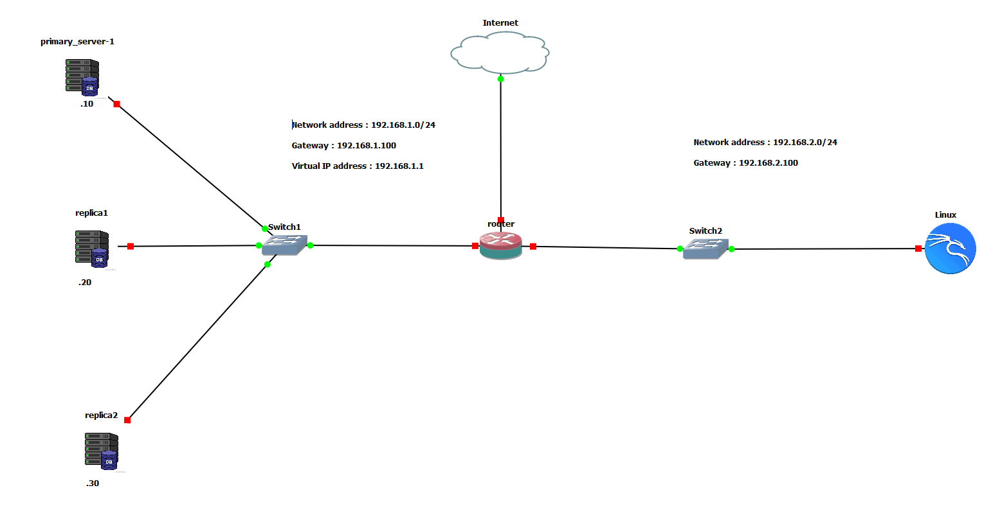
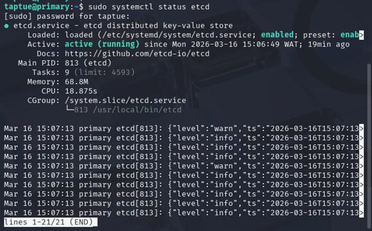
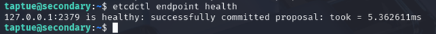
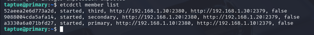
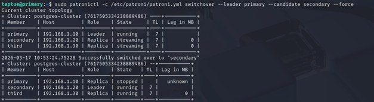
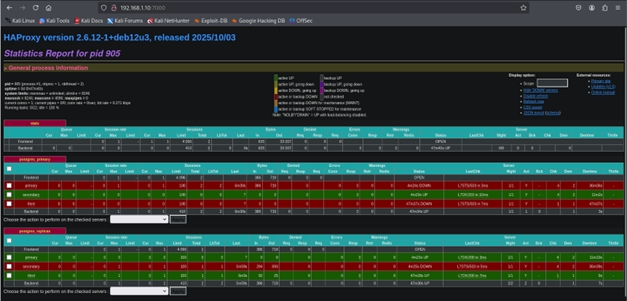
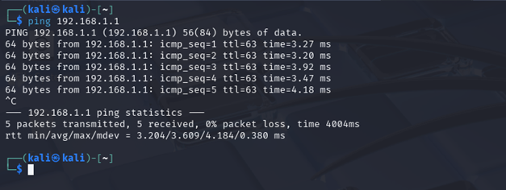

# 🚀 PostgreSQL High Availability Cluster

     

### Patroni + etcd + HAProxy + Keepalived

A **production-style PostgreSQL High Availability (HA) cluster** built with open-source tools on Debian 12.

This repository demonstrates how to design a **fault-tolerant PostgreSQL infrastructure** with automatic failover, load balancing, and a floating Virtual IP for uninterrupted database access.

---

## Architecture Overview

The cluster consists of **three PostgreSQL nodes** managed by Patroni and coordinated by etcd.

One node acts as the **Primary (Leader)** and the others act as **Replicas (Standby)**.

HAProxy routes database connections to the correct node, and Keepalived provides a **Virtual IP (VIP)** for seamless failover.

A typical high availability solution combines:
- a database cluster
- a distributed configuration store
- a load balancer
- failover automation

---

## Architecture Diagram



---

## Technologies Used

| Component | Role |
|-----------|------|
| PostgreSQL 17 | Database engine |
| Patroni | PostgreSQL cluster manager |
| etcd | Distributed consensus store |
| HAProxy | Load balancer |
| Keepalived | Virtual IP failover |
| Debian 12 | Operating system |

In this architecture, **Patroni manages PostgreSQL instances and uses etcd to store cluster state and coordinate leader election**, while HAProxy routes traffic to the active primary node.

---

## Cluster Nodes

| Hostname | IP Address | Role |
|----------|------------|------|
| primary | 192.168.1.10 | Leader |
| secondary | 192.168.1.20 | Replica |
| third | 192.168.1.30 | Replica |

---

## Ports and Services

| Port | Service | Description |
|------|---------|-------------|
| 5432 | PostgreSQL | Database connection |
| 8008 | Patroni REST API | Cluster health checks |
| 2379 | etcd client | etcd communication |
| 2380 | etcd peer | etcd cluster communication |
| 5000 | HAProxy | Primary (read/write) |
| 5001 | HAProxy | Replicas (read-only) |
| 7000 | HAProxy Stats | Web monitoring |

---

## Features

✔ Automatic failover  
✔ Leader election  
✔ PostgreSQL streaming replication  
✔ Read/write traffic routing  
✔ Load balancing for replicas  
✔ Virtual IP failover  
✔ High availability architecture  

---

## Cluster Setup

The deployment consists of the following steps:

1. Configure hostnames
2. Install dependencies
3. Install and configure the etcd cluster
4. Install PostgreSQL
5. Install and configure Patroni
6. Deploy HAProxy load balancing
7. Configure Keepalived virtual IP
8. Test failover

---

## 1. Configure Hosts

On each server:

```sh
sudo nano /etc/hosts
```

Add:

```txt
192.168.1.10 primary
192.168.1.20 secondary
192.168.1.30 third
```

---

## 2. Install Dependencies

```sh
sudo apt update && sudo apt upgrade -y

sudo apt install -y \
  python3 \
  python3-pip \
  python3-psycopg2 \
  python3-yaml \
  python3-requests \
  curl \
  wget \
  gnupg \
  ca-certificates \
  lsb-release
```

---

## 3. Install etcd

On each server:

```sh
ETCD_VERSION="3.5.17"

wget "https://github.com/etcd-io/etcd/releases/download/v${ETCD_VERSION}/etcd-v${ETCD_VERSION}-linux-amd64.tar.gz" \
  -O /tmp/etcd.tar.gz

tar xzf /tmp/etcd.tar.gz -C /tmp

sudo cp /tmp/etcd-v${ETCD_VERSION}-linux-amd64/etcd* /usr/local/bin/
sudo chmod +x /usr/local/bin/etcd*
```

Verify installation:

```sh
etcd --version
```


Create the etcd system user and directories:

```sh
sudo useradd --system --shell /sbin/nologin --home /var/lib/etcd etcd
sudo mkdir -p /var/lib/etcd
sudo chown etcd:etcd /var/lib/etcd
sudo chmod 700 /var/lib/etcd

sudo mkdir -p /etc/etcd
sudo chown etcd:etcd /etc/etcd
```

Create the file `/etc/etcd/etcd.conf` on each server.

### primary

```env
ETCD_NAME="primary"
ETCD_DATA_DIR="/var/lib/etcd"
ETCD_INITIAL_CLUSTER="primary=http://192.168.1.10:2380,secondary=http://192.168.1.20:2380,third=http://192.168.1.30:2380"
ETCD_INITIAL_CLUSTER_TOKEN="etcd-cluster"
ETCD_LISTEN_PEER_URLS="http://0.0.0.0:2380"
ETCD_LISTEN_CLIENT_URLS="http://0.0.0.0:2379"
ETCD_INITIAL_ADVERTISE_PEER_URLS="http://192.168.1.10:2380"
ETCD_ADVERTISE_CLIENT_URLS="http://192.168.1.10:2379"
ETCD_HEARTBEAT_INTERVAL="250"
ETCD_ELECTION_TIMEOUT="2500"
```

### secondary

```env
ETCD_NAME="secondary"
ETCD_DATA_DIR="/var/lib/etcd"
ETCD_INITIAL_CLUSTER="primary=http://192.168.1.10:2380,secondary=http://192.168.1.20:2380,third=http://192.168.1.30:2380"
ETCD_INITIAL_CLUSTER_TOKEN="etcd-cluster"
ETCD_LISTEN_PEER_URLS="http://0.0.0.0:2380"
ETCD_LISTEN_CLIENT_URLS="http://0.0.0.0:2379"
ETCD_INITIAL_ADVERTISE_PEER_URLS="http://192.168.1.20:2380"
ETCD_ADVERTISE_CLIENT_URLS="http://192.168.1.20:2379"
ETCD_HEARTBEAT_INTERVAL="250"
ETCD_ELECTION_TIMEOUT="2500"
```

### third

```env
ETCD_NAME="third"
ETCD_DATA_DIR="/var/lib/etcd"
ETCD_INITIAL_CLUSTER="primary=http://192.168.1.10:2380,secondary=http://192.168.1.20:2380,third=http://192.168.1.30:2380"
ETCD_INITIAL_CLUSTER_TOKEN="etcd-cluster"
ETCD_LISTEN_PEER_URLS="http://0.0.0.0:2380"
ETCD_LISTEN_CLIENT_URLS="http://0.0.0.0:2379"
ETCD_INITIAL_ADVERTISE_PEER_URLS="http://192.168.1.30:2380"
ETCD_ADVERTISE_CLIENT_URLS="http://192.168.1.30:2379"
ETCD_HEARTBEAT_INTERVAL="250"
ETCD_ELECTION_TIMEOUT="2500"
```

On each server, create `/etc/etcd/initial-state.conf` with:

```sh
nano /etc/etcd/initial-state.conf
```
```env
ETCD_INITIAL_CLUSTER_STATE="new"
```

Then apply the correct ownership:

```sh
sudo chown etcd:etcd /etc/etcd/initial-state.conf
```

Create a systemd service for etcd:

```sh
sudo tee /etc/systemd/system/etcd.service > /dev/null <<'EOF'
[Unit]
Description=etcd distributed key-value store
Documentation=https://github.com/etcd-io/etcd
After=network.target
Wants=network-online.target

[Service]
Type=simple
User=etcd
Group=etcd
EnvironmentFile=/etc/etcd/etcd.conf
EnvironmentFile=/etc/etcd/initial-state.conf
ExecStart=/usr/local/bin/etcd
Restart=on-failure
RestartSec=5
LimitNOFILE=65536
TimeoutStartSec=120

[Install]
WantedBy=multi-user.target
EOF
```

Start the etcd cluster (run on all nodes around the same time):

```sh
sudo systemctl daemon-reload
sudo systemctl enable etcd
sudo systemctl start etcd
sudo systemctl status etcd
```



Check cluster health:

```sh
etcdctl endpoint health
etcdctl member list
```




---

## 4. Install PostgreSQL

Add the PostgreSQL repository:

```sh
DISTRO_RELEASE=$(lsb_release -cs)

curl -fsSL https://www.postgresql.org/media/keys/ACCC4CF8.asc \
  | sudo gpg --dearmor -o /usr/share/keyrings/postgresql-keyring.gpg

echo "deb [signed-by=/usr/share/keyrings/postgresql-keyring.gpg] http://apt.postgresql.org/pub/repos/apt ${DISTRO_RELEASE}-pgdg main" \
  | sudo tee /etc/apt/sources.list.d/pgdg.list

sudo apt update
```

Install PostgreSQL:

```sh
sudo apt install -y postgresql-17 postgresql-client-17 postgresql-contrib-17
```

Disable the default PostgreSQL service (Patroni will manage PostgreSQL):

```sh
sudo systemctl stop postgresql
sudo systemctl disable postgresql
```

---

## 5. Install Patroni

On each server:

```sh
sudo pip3 install --break-system-packages "patroni[etcd]==4.0.4"
```

Verify the version:

```sh
patroni --version
```


---

## 6. Configure Patroni

Patroni manages:
- cluster bootstrap
- replication
- failover
- PostgreSQL configuration

On each server:

```sh
sudo mkdir -p /etc/patroni
sudo chown postgres:postgres /etc/patroni
sudo chmod 750 /etc/patroni
```

Create `/etc/patroni/patroni.yml` and populate it according to the node role.

> The configuration blocks below are examples; adjust IP addresses and node names as needed.

### Primary node (primary)

```yaml
scope: postgres-cluster
namespace: /service/
name: primary

restapi:
  listen: 192.168.1.10:8008
  connect_address: 192.168.1.10:8008

etcd3:
  hosts: 192.168.1.10:2379,192.168.1.20:2379,192.168.1.30:2379

bootstrap:
  dcs:
    ttl: 30
    loop_wait: 10
    retry_timeout: 10
    maximum_lag_on_failover: 1048576
    postgresql:
      use_pg_rewind: true
      use_slots: true
      parameters:
        max_connections: 200
        shared_buffers: 256MB
        effective_cache_size: 768MB
        maintenance_work_mem: 64MB
        checkpoint_completion_target: 0.9
        wal_buffers: 16MB
        default_statistics_target: 100
        random_page_cost: 1.1
        effective_io_concurrency: 200
        work_mem: 4MB
        huge_pages: off
        min_wal_size: 1GB
        max_wal_size: 4GB
        max_worker_processes: 4
        max_parallel_workers_per_gather: 2
        max_parallel_workers: 4
        max_parallel_maintenance_workers: 2
        wal_level: replica
        hot_standby: on
        max_wal_senders: 10
        max_replication_slots: 10
        hot_standby_feedback: on

  initdb:
    - encoding: UTF8
    - data-checksums

  pg_hba:
    - host replication replicator 0.0.0.0/0 scram-sha-256
    - host all all 0.0.0.0/0 scram-sha-256
    - local all all peer

  users:
    postgres:
      password: "admin123"
      options:
        - superuser
    replicator:
      password: "admin123"
      options:
        - replication
    rewind_user:
      password: "admin123"
      options:
        - superuser

postgresql:
  listen: 192.168.1.10:5432
  connect_address: 192.168.1.10:5432
  data_dir: /var/lib/postgresql/17/main
  bin_dir: /usr/lib/postgresql/17/bin
  pgpass: /tmp/pgpass
  authentication:
    superuser:
      username: postgres
      password: "admin123"
    replication:
      username: replicator
      password: "admin123"
    rewind:
      username: rewind_user
      password: "admin123"
  parameters:
    unix_socket_directories: '/var/run/postgresql'

tags:
  nofailover: false
  noloadbalance: false
  clonefrom: false
  nosync: false
```

### Secondary node (secondary)

Use the same configuration as the primary, but update the node name, and listen/connect addresses:

```yaml
name: secondary
restapi:
  listen: 192.168.1.20:8008
  connect_address: 192.168.1.20:8008

postgresql:
  listen: 192.168.1.20:5432
  connect_address: 192.168.1.20:5432
  ...
```

### Third node (third)

Use the same configuration as the primary, but update the node name, REST API address, and listen/connect addresses:

```yaml
name: third
restapi:
  listen: 192.168.1.30:8008
  connect_address: 192.168.1.30:8008

postgresql:
  listen: 192.168.1.30:5432
  connect_address: 192.168.1.30:5432
```

After creating the config file:

```sh
sudo chown postgres:postgres /etc/patroni/patroni.yml
sudo chmod 640 /etc/patroni/patroni.yml
```

---

## 7. Start the Cluster

Create the systemd service for Patroni on each server:

```sh
sudo tee /etc/systemd/system/patroni.service > /dev/null <<'EOF'
[Unit]
Description=Patroni PostgreSQL Cluster Manager
After=network.target etcd.service

[Service]
Type=simple
User=postgres
Group=postgres
ExecStart=/usr/local/bin/patroni /etc/patroni/patroni.yml
ExecReload=/bin/kill -s HUP $MAINPID
KillMode=process
TimeoutSec=30
Restart=on-failure

[Install]
WantedBy=multi-user.target
EOF
```

Start Patroni on the **primary node first**:

```sh
sudo systemctl daemon-reload
sudo systemctl enable patroni
sudo systemctl start patroni
```

Then start Patroni on the replica nodes.

Check cluster status:

```sh
patronictl -c /etc/patroni/patroni.yml list
```


---

## 8. Install HAProxy

On each node:

```sh
sudo apt install -y haproxy
```

HAProxy provides:

- Read/write endpoint
- Read-only endpoint
- Health checks via Patroni REST API

Replace the contents of `/etc/haproxy/haproxy.cfg` with:

```sh
sudo nano /etc/haproxy/haproxy.cfg
```

```cfg
global
    log /dev/log local0
    log /dev/log local1 notice
    chroot /var/lib/haproxy
    stats socket /run/haproxy/admin.sock mode 660 level admin expose-fd listeners
    stats timeout 30s
    user haproxy
    group haproxy
    daemon
    maxconn 4096

defaults
    log global
    mode tcp
    option tcplog
    option dontlognull
    timeout connect 10s
    timeout client 30m
    timeout server 30m
    timeout check 5s
    retries 3

# =============================================================================
# STATS INTERFACE
# =============================================================================
listen stats
    bind *:7000
    mode http
    stats enable
    stats uri /
    stats refresh 10s
    stats show-legends
    stats admin if TRUE
    stats auth admin:admin

# =============================================================================
# POSTGRESQL PRIMARY (READ-WRITE)
# =============================================================================
# Connects to the current PostgreSQL leader only
# Uses Patroni REST API to determine leader status

listen postgres_primary
    bind *:5000
    mode tcp
    option httpchk GET /primary
    http-check expect status 200
    default-server inter 3s fall 3 rise 2 on-marked-down shutdown-sessions
    server primary 192.168.1.10:5432 maxconn 100 check port 8008
    server secondary 192.168.1.20:5432 maxconn 100 check port 8008
    server third 192.168.1.30:5432 maxconn 100 check port 8008

# =============================================================================
# POSTGRESQL REPLICAS (READ-ONLY)
# =============================================================================
# Connects to replica nodes only for read-only queries
# Uses Patroni REST API to determine replica status

listen postgres_replicas
    bind *:5001
    mode tcp
    balance leastconn
    option httpchk GET /replica
    http-check expect status 200
    default-server inter 3s fall 3 rise 2 on-marked-down shutdown-sessions
    server primary 192.168.1.10:5432 maxconn 100 check port 8008
    server secondary 192.168.1.20:5432 maxconn 100 check port 8008
    server third 192.168.1.30:5432 maxconn 100 check port 8008
```

Check the configuration:

```sh
sudo haproxy -c -f /etc/haproxy/haproxy.cfg
```

Restart HAProxy:

```sh
sudo systemctl enable haproxy
sudo systemctl restart haproxy
```

---

## 9. Install Keepalived

On each node:

```sh
sudo apt install -y keepalived
```

Virtual IP used: `192.168.1.1`

Create `/etc/keepalived/keepalived.conf` on each HAProxy node.

### primary

```cfg
vrrp_instance VI_1 {
    state MASTER
    interface ens33              # Replace with your network interface
    virtual_router_id 51
    priority 100                 # Highest priority for the primary node
    advert_int 1
    authentication {
        auth_type PASS
        auth_pass admin123
    }
    virtual_ipaddress {
        192.168.1.1/24            # Your floating VIP
    }
}
```

### secondary

```cfg
vrrp_instance VI_1 {
    state BACKUP
    interface ens33              # Replace with your network interface
    virtual_router_id 51
    priority 90
    advert_int 1
    authentication {
        auth_type PASS
        auth_pass admin123
    }
    virtual_ipaddress {
        192.168.1.1/24            # Your floating VIP
    }
}
```

### third

```cfg
vrrp_instance VI_1 {
    state BACKUP
    interface ens33              # Replace with your network interface
    virtual_router_id 51
    priority 80
    advert_int 1
    authentication {
        auth_type PASS
        auth_pass admin123
    }
    virtual_ipaddress {
        192.168.1.1/24            # Your floating VIP
    }
}
```

Start Keepalived:

```sh
sudo systemctl enable keepalived
sudo systemctl start keepalived
sudo systemctl status keepalived
```

Keepalived ensures the **VIP automatically moves to another node if the master fails**.


---

# Failover Test

# Test Failover

Check cluster:


patronictl -c /etc/patroni/patroni.yml list


Manual switchover:


patronictl -c /etc/patroni/patroni.yml switchover
--leader primary
--candidate secondary
--force


The **secondary node becomes the new leader**.



---

# HAProxy Monitoring

Open the dashboard:


http://192.168.1.10:7000


Credentials:


admin
admin



---

# Virtual IP Test

Connect using VIP:


psql -h 192.168.1.1 -p 5000 -U postgres


Stop Keepalived on master:


sudo systemctl stop keepalived


VIP should migrate automatically.



---

# Future Improvements

Possible extensions:

- WAL Archiving
- Point-in-Time Recovery (PITR)
- Prometheus + Grafana monitoring
- TLS encryption
- PgBouncer connection pooling
- Ansible automation

---

# Author

TAPTUE Russel

Cybersecurity | Cloud | DevOps | SRE

---

# License

MIT License

---

# If you like this project

Give it a ⭐ on GitHub